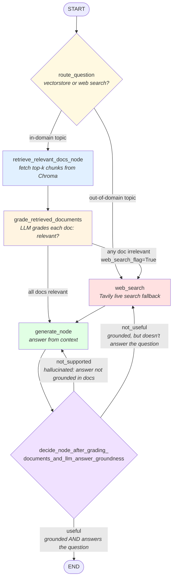

# Agentic RAG v1

An **Adaptive + Corrective + Self-RAG** pipeline built with [LangGraph](https://langchain-ai.github.io/langgraph/). It doesn't just retrieve-and-generate — it routes the question intelligently, grades its own retrieval, grades its own generation, and corrects itself when any step is untrustworthy.

## Why this isn't "naive" RAG

Naive RAG retrieves top-k chunks and generates an answer, full stop — no checks. This project adds three layers of self-critique on top of that:

1. **Adaptive routing** — before retrieving anything, an LLM classifier decides whether the question actually belongs to this project's domain (agents, prompt engineering, adversarial attacks on LLMs) or not. In-domain questions go to the vector store; anything else skips straight to web search, instead of wasting a retrieval + grading cycle on documents that were always going to be irrelevant.
2. **Corrective retrieval** — after retrieving, an LLM grades each document for relevance to the question. Irrelevant documents are dropped. If *any* document was dropped, the graph falls back to a live web search (via Tavily) instead of trusting a possibly-incomplete local index.
3. **Self-RAG generation checks** — after generating an answer, two more LLM graders check it:
   - **Hallucination grader** — is the answer actually grounded in the retrieved documents, or did the model invent something beyond them?
   - **Answer grader** — even if grounded, does the answer actually resolve the user's question (or is it a "the docs don't say" non-answer)?

Failures route back into the graph instead of just returning a bad answer.

## Data source

`ingestion.py` scrapes three of Lilian Weng's blog posts (LLM agents, prompt engineering, adversarial attacks on LLMs) via `WebBaseLoader`, splits them into ~250-token chunks (`RecursiveCharacterTextSplitter.from_tiktoken_encoder`), and stores embeddings in a local Chroma vector store (`./.chroma`).

## The graph



### Node by node

| Node | File | What it does |
|---|---|---|
| *(routing only)* `route_question` | `graph/nodes/edges.py` | Adaptive RAG entry point. Runs `intent_classifier_chain` to decide whether the question belongs in the vector store's domain or should go straight to web search. |
| `retrieve_relevant_docs_node` | `graph/nodes/retrieve.py` | Similarity search against the Chroma vector store for the user's question. |
| `grade_retrieved_documents` | `graph/nodes/grade_documents.py` | Runs `retrieval_grader_chain` on each doc; keeps only the ones graded relevant; sets `web_search_flag=True` if *any* doc was rejected. |
| `web_search` | `graph/nodes/web_search.py` | Falls back to a live Tavily search when local retrieval wasn't good enough, or when `route_question` skipped retrieval entirely. |
| `generate_node` | `graph/nodes/generate.py` | Generates an answer from the current `retrieved_documents` via `generation_chain`. |
| *(routing only)* `decide_node_after_grading_documents_and_llm_answer_groundness` | `graph/nodes/edges.py` | Runs `hallucination_grader_chain` (grounded?) then `answer_grader_chain` (useful?) on the generation, and routes accordingly. |

### Adaptive routing at the entry point

`route_question` is the first thing that runs, before any retrieval happens. It uses `intent_classifier_chain` (`graph/chains/intent_classifier.py`) — a structured-output LLM call — to classify the question as `vectorstore` (fits this project's indexed topics: agents, prompt engineering, adversarial attacks on LLMs) or `web_search` (anything else). This avoids wasting a retrieval + grading cycle on questions that were never going to match the local index — e.g. "What is a dream?" routes straight to `web_search` instead of first fetching and rejecting irrelevant chunks.

### The two failure modes after generation

- **`not_supported`** — the answer isn't grounded in the retrieved documents (the LLM said something the docs don't support). This is a *generation* problem, not a retrieval problem — the docs may be fine, but the model drifted. Routes back to `generate_node` to retry.
- **`not_useful`** — the answer *is* grounded in the docs (no hallucination), but it doesn't actually resolve the question — usually because the docs simply don't contain the answer. This is a *retrieval* problem, so it routes to `web_search` to fetch better information rather than re-asking the same model the same question with the same context.

## Project layout

```
agentic-RAG-v1/
├── ingestion.py                          # scrape → chunk → embed → Chroma retriever
├── langgraph.json                        # langgraph dev / Studio config
├── graph/
│   ├── state.py                          # GraphState: question, generation, web_search_flag, retrieved_documents
│   ├── llm_model.py                      # shared ChatOpenAI instance (gpt-4o-mini)
│   ├── objects.py                        # Pydantic schemas for structured LLM grading output
│   ├── prompts.py                        # grader system prompt
│   ├── graph.py                          # wires all nodes + conditional edges together
│   ├── chains/
│   │   ├── intent_classifier.py          # "vectorstore or web search?" routing chain
│   │   ├── retrieval_grader.py           # "is this doc relevant?" chain
│   │   ├── generation.py                 # "answer the question from context" chain
│   │   ├── hallucination_grader_chain.py # "is this answer grounded in the docs?" chain
│   │   ├── answer_grader_chain.py        # "does this answer resolve the question?" chain
│   │   └── tests/test_chains.py          # pytest coverage for all four chains
│   └── nodes/
│       ├── retrieve.py
│       ├── grade_documents.py
│       ├── web_search.py
│       ├── generate.py
│       └── edges.py                      # conditional-edge routing functions
```

## Setup

```bash
uv sync
```

Create a `.env` file in the project root (never commit this file) with:

```
OPENAI_API_KEY=...
TAVILY_API_KEY=...
```

## Running it

**Ingest the data first** (uncomment the `Chroma.from_documents(...)` block in `ingestion.py` to actually populate the vector store, then run it once):

```bash
uv run python ingestion.py
```

**Then run the graph interactively in LangGraph Studio:**

```bash
uv run langgraph dev
```

**Or run the tests:**

```bash
uv run pytest -v
```

**Or invoke the graph directly:**

```python
from graph.graph import graph

result = graph.invoke({"question": "What is agent memory?"})
print(result["generation"])
```
